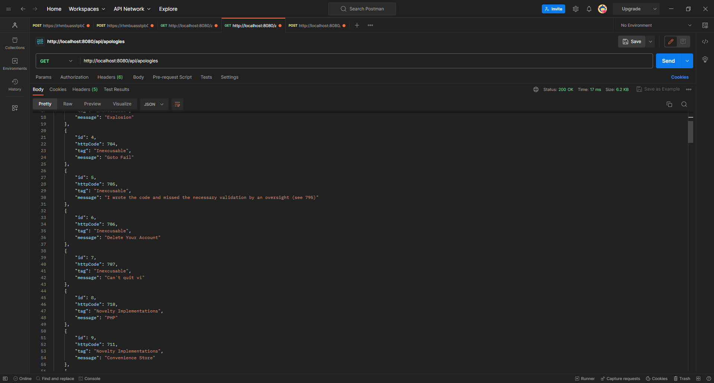
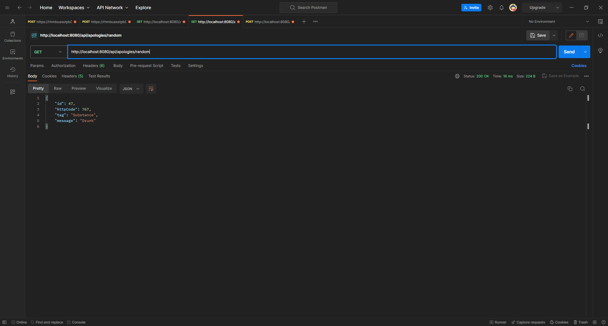
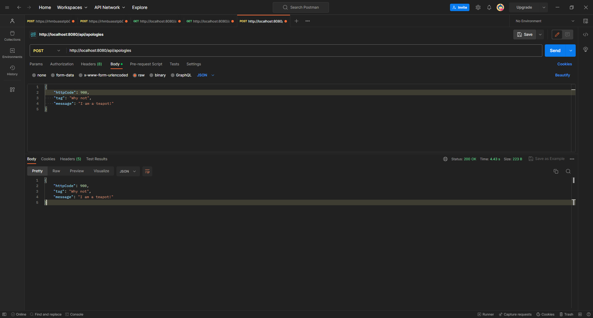

<h3 align="center">Dev Apologies Generate</h3>

<p align="center">
A backend application which will generate random apologies for a developer
</p>

<!-- PROJECT LOGO -->
<br />
<div align="center">
  <a href="https://github.com/qloots/dev-apologies-randomizer">
    
  </a>

<h3 align="center">Dev Apologies Randomizer</h3>

  <p align="center">
    <br />
    <a href="https://github.com/qloots/dev-apologies-randomizer"><strong>Explore the docs »</strong></a>
    <br />
    <br />
    <a href="https://github.com/qloots/dev-apologies-randomizer">View Demo</a>
    ·
    <a href="https://github.com/qloots/dev-apologies-randomizer/issues">Report Bug</a>
    ·
    <a href="https://github.com/qloots/dev-apologies-randomizer/issues">Request Feature</a>
  </p>
</div>

<!-- TABLE OF CONTENTS -->
<details>
  <summary>Table of Contents</summary>
  <ol>
    <li>
      <a href="#about-the-project">About The Project</a>
      <ul>
        <li><a href="#built-with">Built With</a></li>
      </ul>
    </li>
    <li>
      <a href="#getting-started">Getting Started</a>
      <ul>
        <li><a href="#prerequisites">Prerequisites</a></li>
        <li><a href="#installation">Installation</a></li>
      </ul>
    </li>
    <li><a href="#usage">Usage</a></li>
    <li><a href="#contributing">Contributing</a></li>
  </ol>
</details>


<!-- ABOUT THE PROJECT -->
## About The Project

You are a developer and a customer is asking you something?  
Here is the random apologies generator you need to make him waiting !

<p align="right">(<a href="#readme-top">back to top</a>)</p>


### Built With

* Java 17
* Maven
* Docker
* Postgres

<p align="right">(<a href="#readme-top">back to top</a>)</p>


<!-- GETTING STARTED -->
## Getting Started

### Prerequisites

To run the project, you will need : 
* Java 17
* Maven
* Docker

### Installation

1. Clone the repo
   ```sh
   git clone https://github.com/qloots/dev-apologies-randomizer.git
   ```
2. Open it in your favorite IDE
3. Build the PostgreSQL Docker image
   ```sh
   docker compose up -d
   ```
4. Run the ``DevApologiesRandomizerApplication`` via your IDE 
5. Enjoy it with Postman in a fist time

<p align="right">(<a href="#readme-top">back to top</a>)</p>


<!-- USAGE EXAMPLES -->
## Usage

### Get all apologies  
``GET http://localhost:8080/api/apologies`` will return you all the available apologies.  


### Get a random apology
``GET http://localhost:8080/api/apologies/random`` will return you a random apology t give to your customer.  



### Add an apology
``POST http://localhost:8080/api/apologies`` will add an apology into the database.  


<p align="right">(<a href="#readme-top">back to top</a>)</p>


### Stop the project
1. Stop the running application from your IDE.
2. Shut down the dockerized PostgreSQL: 
   ```sh
   docker compose down
   ```
3. Delete all containers:
   ```sh
   docker rm -f $(docker ps -a -q)
   ```
4. Delete all volumes:
   ```sh
   docker volume rm $(docker volume ls -q)
   ```


<!-- CONTRIBUTING -->
## Contributing

Contributions are what make the open source community such an amazing place to learn, inspire, and create. Any contributions you make are **greatly appreciated**.

If you have a suggestion that would make this better, please fork the repo and create a pull request. You can also simply open an issue with the tag "enhancement".
Don't forget to give the project a star! Thanks again!

1. Fork the Project
2. Create your Feature Branch (`git checkout -b feat/AmazingFeature`)
3. Commit your Changes (`git commit -m 'Add some Amazing Feature'`)
4. Push to the Branch (`git push origin feat/AmazingFeature`)
5. Open a Pull Request

<p align="right">(<a href="#readme-top">back to top</a>)</p>